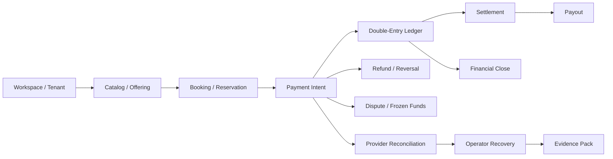
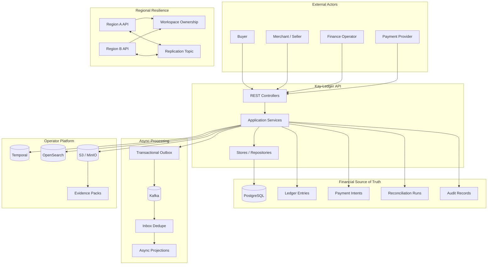
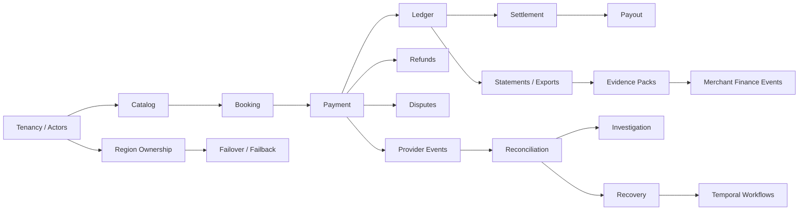
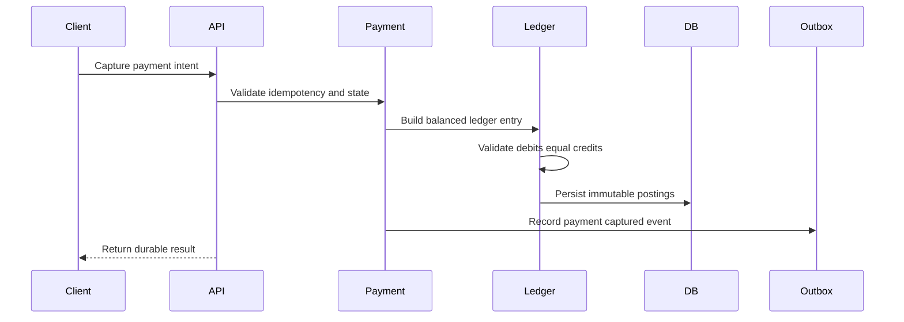
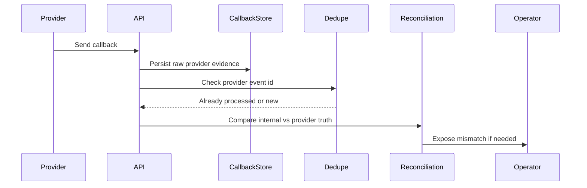
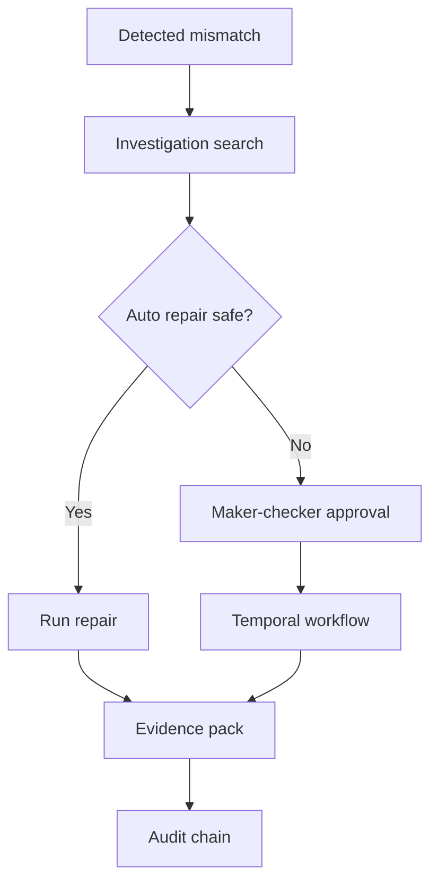

# Kay-Ledger

**Kay-Ledger** is a production-shaped Java/Spring Boot backend platform for **financial correctness**, **double-entry ledger design**, **marketplace payments**, **settlement**, **payouts**, **refunds**, **subscriptions**, **provider reconciliation**, **operator recovery**, **financial close**, **audit evidence**, and **multi-region resilience**.

It is built around one core idea:

> In a financial backend, success is not “the API returned 200.”  
> Success is “the system can prove what happened to the money after retries, provider chaos, operator intervention, and failure.”

Kay-Ledger is designed as a serious backend portfolio project. It focuses on the kind of problems that show up in payment platforms, marketplaces, fintech systems, billing engines, merchant platforms, reconciliation systems, and financial operations tooling.

## Table of contents

- [Why this project exists](#why-this-project-exists)
- [What Kay-Ledger proves](#what-kay-ledger-proves)
- [The short version](#the-short-version)
- [Architecture at a glance](#architecture-at-a-glance)
- [Core capabilities](#core-capabilities)
- [Domain map](#domain-map)
- [Runtime stack](#runtime-stack)
- [Repository guide](#repository-guide)
- [Documentation map](#documentation-map)
- [Key architecture decisions](#key-architecture-decisions)
- [System flows](#system-flows)
- [Correctness model](#correctness-model)
- [Operations model](#operations-model)
- [Testing strategy](#testing-strategy)
- [What makes this senior-backend shaped](#what-makes-this-senior-backend-shaped)
- [What this project does not claim](#what-this-project-does-not-claim)
- [Suggested reading path](#suggested-reading-path)

## Why this project exists

Most backend portfolio projects prove that someone can build endpoints, persist records, and return JSON.

Kay-Ledger is different.

It focuses on harder backend questions:

- How do you prevent duplicate charges when clients retry?
- How do you model money without silently corrupting balances?
- How do you prove that ledger entries balance?
- How do you handle provider callbacks that are late, duplicated, or out of order?
- How do you compare internal financial truth against provider truth?
- How do you repair drift without manually editing production data?
- How do you close an accounting period and prevent silent historical mutation?
- How do you gate dangerous operator actions behind approval?
- How do you produce evidence for merchants, support teams, operators, and auditors?
- How do you model regional failover without unsafe dual writes?

The project is intentionally centered on **money correctness and operational truth**, because those are the areas where senior backend engineering becomes much more than CRUD.

Backlinks:

- [Project narrative](docs/project-narrative.md)
- [Proof of seriousness](docs/proof-of-seriousness.md)
- [Financial invariants](docs/architecture/financial-invariants.md)
- [Source of truth map](docs/reference/source-of-truth-map.md)

## What Kay-Ledger proves

Kay-Ledger demonstrates backend design across several difficult areas.

### Financial correctness

- double-entry ledger postings
- immutable financial facts
- derived balances
- payment lifecycle state machines
- refunds, reversals, disputes, and frozen funds
- settlement and payout separation
- financial close and locked accounting windows

Read more:

- [Money model](docs/architecture/money-model.md)
- [Double-entry ledger](docs/architecture/double-entry-ledger.md)
- [Balance derivation](docs/architecture/balance-derivation.md)
- [Financial close](docs/architecture/financial-close.md)

### Failure-safe writes

- idempotent mutation boundaries
- duplicate request safety
- retry-safe payment operations
- outbox-based event publication
- inbox-based event deduplication
- replay and re-drive paths

Read more:

- [Idempotency and write paths](docs/architecture/idempotency-and-write-paths.md)
- [Async outbox and inbox](docs/architecture/async-outbox-inbox.md)
- [Outbox/inbox runbook](docs/operations/outbox-inbox-runbook.md)

### Provider and reconciliation truth

- provider callbacks treated as external evidence
- duplicate/out-of-order callback handling
- provider truth imports
- reconciliation mismatch classification
- drift repair
- operator recovery evidence

Read more:

- [Provider webhook truth](docs/architecture/provider-webhook-truth.md)
- [Reconciliation and provider truth](docs/architecture/reconciliation-and-provider-truth.md)
- [Provider callback runbook](docs/operations/provider-callback-runbook.md)
- [Reconciliation runbook](docs/operations/reconciliation-runbook.md)

### Operator-grade recovery

- OpenSearch investigation surfaces
- Temporal-backed long-running workflows
- financial operation runtime controls
- maker-checker approvals
- evidence packs
- merchant finance event delivery truth
- incident playbooks

Read more:

- [Operator recovery](docs/architecture/operator-recovery.md)
- [Temporal workflows](docs/architecture/temporal-workflows.md)
- [Approvals and maker-checker](docs/architecture/approvals-maker-checker.md)
- [Evidence packs](docs/architecture/evidence-packs.md)
- [Merchant finance events](docs/architecture/merchant-finance-events.md)
- [Incident response playbooks](docs/operations/incident-response-playbooks.md)

### Resilience and regional safety

- multi-region simulation
- active-region ownership
- stale read visibility
- workspace failover
- failback and recovery audit
- write fencing

Read more:

- [Multi-region and recovery](docs/architecture/multi-region-and-recovery.md)
- [Multi-region failover runbook](docs/operations/multi-region-failover-runbook.md)
- [Region partition and fencing drill](docs/operations/failure-drills/region-partition-and-fencing.md)

## The short version

Kay-Ledger is a backend system that models the financial lifecycle of a marketplace:



At a high level:

1. A buyer books or purchases something.
2. A payment intent is created.
3. Payment state transitions are recorded.
4. Financial movement is posted through a double-entry ledger.
5. Settlement creates payable balances.
6. Payouts move funds externally.
7. Refunds, disputes, and reversals create compensating financial flows.
8. Provider callbacks are ingested as evidence, not blindly trusted.
9. Reconciliation compares internal truth against provider truth.
10. Operators investigate, approve, repair, and generate evidence.
11. Financial close locks windows and finalizes statements.
12. Regional ownership protects writes during failover.

## Architecture at a glance



Deeper docs:

- [System overview](docs/architecture/system-overview.md)
- [Domain boundaries](docs/architecture/domain-boundaries.md)
- [System context diagram](docs/diagrams/system-context.mmd)
- [Money flow diagram](docs/diagrams/money-flow.mmd)
- [Reconciliation flow diagram](docs/diagrams/reconciliation-flow.mmd)
- [Operator recovery flow diagram](docs/diagrams/operator-recovery-flow.mmd)

## Core capabilities

| Capability | What it demonstrates | Docs |
|---|---|---|
| Domain backbone | Tenancy, actors, permissions, ownership boundaries | [Domain boundaries](docs/architecture/domain-boundaries.md) |
| Catalog and booking | Offerings, pricing, reservations, holds, contention safety | [Booking contention](docs/architecture/booking-contention.md) |
| Idempotent mutations | Duplicate-safe finance writes | [Idempotency](docs/architecture/idempotency-and-write-paths.md) |
| Ledger core | Accounts, entries, postings, balances | [Double-entry ledger](docs/architecture/double-entry-ledger.md) |
| Payment lifecycle | Payment intents, authorization, capture, escrow | [Payment lifecycle](docs/architecture/payment-lifecycle.md) |
| Settlement and payouts | Payable balances, payout execution, frozen funds | [Settlement and payouts](docs/architecture/settlement-payouts.md) |
| Refunds/disputes | Reversals, disputes, compensation, reserves | [Refunds and disputes](docs/architecture/refunds-disputes-reversals.md) |
| Subscriptions | Recurring billing, renewals, grace, suspension | [Subscriptions](docs/architecture/subscriptions-billing.md) |
| Async processing | Kafka, outbox, inbox, retries, parked events | [Async outbox/inbox](docs/architecture/async-outbox-inbox.md) |
| Provider truth | Webhook safety, provider statements, evidence | [Provider webhook truth](docs/architecture/provider-webhook-truth.md) |
| Reconciliation | Mismatch detection, drift repair, operator recovery | [Reconciliation](docs/architecture/reconciliation-and-provider-truth.md) |
| Investigation | Searchable operational facts | [Search investigation](docs/architecture/search-investigation.md) |
| Reporting/exports | Statements, read models, object storage | [Read models](docs/architecture/read-models-and-statements.md) |
| Temporal workflows | Long-running operator workflows | [Temporal workflows](docs/architecture/temporal-workflows.md) |
| Multi-region | Ownership, write fencing, stale reads, failover | [Multi-region](docs/architecture/multi-region-and-recovery.md) |
| Close/evidence | Locked windows, final statements, proof packs | [Financial close](docs/architecture/financial-close.md) |
| Approvals | Maker-checker sensitive action gating | [Approvals](docs/architecture/approvals-maker-checker.md) |
| Merchant events | External delivery truth and retries | [Merchant finance events](docs/architecture/merchant-finance-events.md) |

## Domain map



The main design rule:

> Every financial boundary owns its invariants.

Examples:

- Ledger owns balanced postings.
- Payment owns payment state transitions.
- Settlement owns payable-balance creation.
- Reconciliation owns mismatch classification.
- Financial close owns locked-window protection.
- Approval owns sensitive action gating.
- Region owns workspace write authority.

Read:

- [Domain boundaries](docs/architecture/domain-boundaries.md)
- [Source of truth map](docs/reference/source-of-truth-map.md)
- [Invariants catalog](docs/reference/invariants-catalog.md)

## Runtime stack

Kay-Ledger uses:

- **Java 21**
- **Spring Boot 3.5.x**
- **Maven**
- **PostgreSQL**
- **Flyway**
- **Kafka**
- **Redis**
- **OpenSearch**
- **S3-compatible object storage / MinIO**
- **Temporal**
- **Docker Compose**
- **Testcontainers**
- **JUnit**

The local Compose stack includes PostgreSQL, Kafka, OpenSearch, MinIO, Temporal, Temporal UI, and separate Region A / Region B API runtimes for regional simulation.

Read:

- [Local development](docs/getting-started/local-development.md)
- [Environment](docs/getting-started/environment.md)
- [Running tests](docs/getting-started/running-tests.md)
- [Operations runbook index](docs/operations/runbook-index.md)

## Repository guide

Typical repo shape:

```text
apps/
  api/
    src/main/java/com/kayledger/api/
    src/main/resources/db/migration/
    src/test/java/com/kayledger/api/
infra/
  docker-compose/
docs/
  architecture/
  adr/
  api/
  diagrams/
  operations/
  reference/
  roadmap/
  testing/
```

Important documentation entry points:

- [Docs home](docs/README.md)
- [Start here](docs/start-here.md)
- [Project narrative](docs/project-narrative.md)
- [Architecture overview](docs/architecture/system-overview.md)
- [Public roadmap](docs/roadmap/public-roadmap.md)
- [Manual public upload checklist](docs/manual-public-upload-checklist.md)

## Documentation map

### Architecture

- [System overview](docs/architecture/system-overview.md)
- [Domain boundaries](docs/architecture/domain-boundaries.md)
- [Financial invariants](docs/architecture/financial-invariants.md)
- [Money model](docs/architecture/money-model.md)
- [Double-entry ledger](docs/architecture/double-entry-ledger.md)
- [Payment lifecycle](docs/architecture/payment-lifecycle.md)
- [Settlement and payouts](docs/architecture/settlement-payouts.md)
- [Refunds, disputes, reversals](docs/architecture/refunds-disputes-reversals.md)
- [Subscriptions and billing](docs/architecture/subscriptions-billing.md)
- [Async outbox/inbox](docs/architecture/async-outbox-inbox.md)
- [Provider webhook truth](docs/architecture/provider-webhook-truth.md)
- [Reconciliation and provider truth](docs/architecture/reconciliation-and-provider-truth.md)
- [Operator recovery](docs/architecture/operator-recovery.md)
- [Temporal workflows](docs/architecture/temporal-workflows.md)
- [Multi-region and recovery](docs/architecture/multi-region-and-recovery.md)
- [Financial close](docs/architecture/financial-close.md)
- [Approvals / maker-checker](docs/architecture/approvals-maker-checker.md)
- [Evidence packs](docs/architecture/evidence-packs.md)
- [Merchant finance events](docs/architecture/merchant-finance-events.md)
- [Security and governance](docs/architecture/security-governance.md)

### API documentation

- [API docs index](docs/api/README.md)
- [Payments API](docs/api/payments-api.md)
- [Ledger API](docs/api/ledger-api.md)
- [Reconciliation API](docs/api/reconciliation-api.md)
- [Temporal workflow API](docs/api/temporal-workflow-api.md)
- [Merchant events API](docs/api/merchant-events-api.md)

### Operations

- [Runbook index](docs/operations/runbook-index.md)
- [Incident response playbooks](docs/operations/incident-response-playbooks.md)
- [Provider callback runbook](docs/operations/provider-callback-runbook.md)
- [Reconciliation runbook](docs/operations/reconciliation-runbook.md)
- [Outbox/inbox runbook](docs/operations/outbox-inbox-runbook.md)
- [Temporal workflows runbook](docs/operations/temporal-workflows-runbook.md)
- [Financial close runbook](docs/operations/financial-close-runbook.md)
- [Approval runbook](docs/operations/approval-runbook.md)
- [Merchant delivery runbook](docs/operations/merchant-delivery-runbook.md)
- [Multi-region failover runbook](docs/operations/multi-region-failover-runbook.md)
- [Evidence pack runbook](docs/operations/evidence-pack-runbook.md)
- [Observability and SLOs](docs/operations/observability-and-slos.md)

### Failure drills

- [Duplicate payment capture](docs/operations/failure-drills/duplicate-payment-capture.md)
- [Provider callback out of order](docs/operations/failure-drills/provider-callback-out-of-order.md)
- [Refund after payout](docs/operations/failure-drills/refund-after-payout.md)
- [Dispute after settlement](docs/operations/failure-drills/dispute-after-settlement.md)
- [Outbox relay crash](docs/operations/failure-drills/outbox-relay-crash.md)
- [Inbox duplicate delivery](docs/operations/failure-drills/inbox-duplicate-delivery.md)
- [Temporal activity failure](docs/operations/failure-drills/temporal-activity-failure.md)
- [Closed period adjustment](docs/operations/failure-drills/closed-period-adjustment.md)
- [Merchant delivery lease conflict](docs/operations/failure-drills/merchant-delivery-lease-conflict.md)
- [Region partition and fencing](docs/operations/failure-drills/region-partition-and-fencing.md)

### Testing and proof

- [Testing strategy](docs/testing/testing-strategy.md)
- [Proof matrix](docs/testing/proof-matrix.md)
- [Test naming guide](docs/testing/test-naming-guide.md)

### Reference

- [Glossary](docs/reference/glossary.md)
- [Finance terms](docs/reference/finance-terms.md)
- [Source of truth map](docs/reference/source-of-truth-map.md)
- [Invariants catalog](docs/reference/invariants-catalog.md)
- [Domain event catalog](docs/reference/domain-event-catalog.md)
- [State machine catalog](docs/reference/state-machine-catalog.md)
- [Operational signals](docs/reference/operational-signals.md)
- [Trade-off catalog](docs/reference/tradeoff-catalog.md)

## Key architecture decisions

ADRs live in [`docs/adr/`](docs/adr/).

Important ADRs:

- [ADR-0001: Use a modular monolith for finance correctness](docs/adr/0001-use-a-modular-monolith-for-finance-correctness.md)
- [ADR-0002: Use PostgreSQL as the financial source of truth](docs/adr/0002-use-postgresql-as-the-financial-source-of-truth.md)
- [ADR-0003: Use immutable double-entry ledger postings](docs/adr/0003-use-immutable-double-entry-ledger-postings.md)
- [ADR-0004: Use idempotency keys at mutation boundaries](docs/adr/0004-use-idempotency-keys-at-mutation-boundaries.md)
- [ADR-0006: Model provider callbacks as external evidence](docs/adr/0006-model-provider-callbacks-as-external-evidence.md)
- [ADR-0007: Use reconciliation instead of trusting provider callbacks blindly](docs/adr/0007-use-reconciliation-instead-of-trusting-provider-callbacks-blindly.md)
- [ADR-0008: Use transactional outbox for durable event publishing](docs/adr/0008-use-transactional-outbox-for-durable-event-publishing.md)
- [ADR-0011: Use Temporal for long-running operator workflows](docs/adr/0011-use-temporal-for-long-running-operator-workflows.md)
- [ADR-0014: Use financial close windows to protect accounting history](docs/adr/0014-use-financial-close-windows-to-protect-accounting-history.md)
- [ADR-0015: Use maker-checker approvals for sensitive finance actions](docs/adr/0015-use-maker-checker-approvals-for-sensitive-finance-actions.md)
- [ADR-0020: Use multi-region ownership and write fencing](docs/adr/0020-use-multi-region-ownership-and-write-fencing.md)
- [ADR-0025: Use evidence packs for audit and dispute support](docs/adr/0025-use-evidence-packs-for-audit-and-dispute-support.md)

## System flows

### Payment capture to ledger



### Provider callback to reconciliation



### Operator recovery workflow



## Correctness model

Kay-Ledger is designed around explicit invariants.

Core invariants:

- Ledger entries must balance.
- Duplicate mutation requests must not double-move money.
- Conflicting idempotency-key reuse must be rejected.
- Provider callbacks must be deduped and interpreted safely.
- Provider truth must be reconciled against internal truth.
- Closed accounting windows must block ordinary mutation.
- Refunds, disputes, and reversals must preserve original history.
- Frozen funds must not be paid out.
- Sensitive financial actions must be approval-gated.
- Wrong-region writes must be fenced.
- Evidence must be generated from durable facts.

Read:

- [Financial invariants](docs/architecture/financial-invariants.md)
- [Invariants catalog](docs/reference/invariants-catalog.md)
- [Proof matrix](docs/testing/proof-matrix.md)

## Operations model

Kay-Ledger treats operations as part of the product.

The system is designed so that operators can:

- investigate financial state
- inspect provider truth
- run reconciliation
- review mismatches
- approve sensitive actions
- trigger recovery workflows
- generate evidence packs
- retry or inspect merchant delivery
- understand regional failover state
- explain what happened after an incident

Read:

- [Operations runbook index](docs/operations/runbook-index.md)
- [Incident response playbooks](docs/operations/incident-response-playbooks.md)
- [Observability and SLOs](docs/operations/observability-and-slos.md)
- [Operational signals](docs/reference/operational-signals.md)

## Testing strategy

The strongest tests in Kay-Ledger are not simple controller tests.

They are behavior proofs:

- duplicate payment capture does not double-post
- ledger entries stay balanced
- closed period blocks unsafe mutation
- provider callback replay is deduped
- reconciliation mismatch becomes visible
- wrong region cannot write
- Temporal workflow status remains truthful
- approval execution cannot bypass maker-checker rules
- merchant event delivery tracks success/failure/retry

Read:

- [Testing strategy](docs/testing/testing-strategy.md)
- [Proof matrix](docs/testing/proof-matrix.md)
- [Test naming guide](docs/testing/test-naming-guide.md)

## What makes this senior-backend shaped

Kay-Ledger demonstrates senior backend thinking because it is built around trade-offs and failure modes.

### It avoids the easy but dangerous path

A basic backend might directly mutate balances and statuses.

Kay-Ledger prefers:

- immutable ledger postings
- derived balances
- idempotent write paths
- explicit state machines
- reconciliation instead of blind trust
- audit evidence instead of hidden mutation
- operator workflows instead of manual database edits

### It has real operational depth

The project includes concepts that teams need when systems become real:

- parked/replay flows
- reconciliation mismatch repair
- workflow status truth
- investigation search
- evidence artifacts
- financial close
- maker-checker approvals
- multi-region ownership and failover

### It has interview-quality trade-offs

Strong discussion topics:

- Why modular monolith instead of microservices?
- Why PostgreSQL for ledger truth?
- Why outbox/inbox instead of direct Kafka publishing?
- Why Temporal for operator workflows?
- Why OpenSearch is derived, not source of truth?
- Why provider callbacks are evidence, not commands?
- Why closed-period changes need controlled adjustment?
- Why active-active writes require ownership/fencing?

Read:

- [Trade-off catalog](docs/reference/tradeoff-catalog.md)
- [ADRs](docs/adr/)
- [Portfolio positioning](docs/roadmap/portfolio-positioning.md)

## What this project does not claim

Kay-Ledger is a **production-shaped educational/portfolio platform**, not a certified financial product.

It does not claim:

- PCI compliance
- banking-grade regulatory approval
- production-ready provider certification
- complete tax/accounting compliance
- full fraud prevention
- real money movement readiness
- complete security hardening for live financial use

It does demonstrate:

- realistic finance backend architecture
- correctness-first design
- operational recovery patterns
- strong domain modeling
- serious testing targets
- senior-level trade-off awareness

Read:

- [Security and governance](docs/architecture/security-governance.md)
- [Public roadmap](docs/roadmap/public-roadmap.md)

## Suggested reading path

### Fast reviewer path

1. [Project narrative](docs/project-narrative.md)
2. [System overview](docs/architecture/system-overview.md)
3. [Financial invariants](docs/architecture/financial-invariants.md)
4. [Proof matrix](docs/testing/proof-matrix.md)
5. [ADRs](docs/adr/)

### Deep architecture path

1. [Domain boundaries](docs/architecture/domain-boundaries.md)
2. [Money model](docs/architecture/money-model.md)
3. [Double-entry ledger](docs/architecture/double-entry-ledger.md)
4. [Payment lifecycle](docs/architecture/payment-lifecycle.md)
5. [Settlement and payouts](docs/architecture/settlement-payouts.md)
6. [Refunds, disputes, reversals](docs/architecture/refunds-disputes-reversals.md)
7. [Reconciliation and provider truth](docs/architecture/reconciliation-and-provider-truth.md)

### Operations path

1. [Runbook index](docs/operations/runbook-index.md)
2. [Incident response playbooks](docs/operations/incident-response-playbooks.md)
3. [Provider callback runbook](docs/operations/provider-callback-runbook.md)
4. [Reconciliation runbook](docs/operations/reconciliation-runbook.md)
5. [Financial close runbook](docs/operations/financial-close-runbook.md)
6. [Multi-region failover runbook](docs/operations/multi-region-failover-runbook.md)

### Resilience path

1. [Async outbox/inbox](docs/architecture/async-outbox-inbox.md)
2. [Temporal workflows](docs/architecture/temporal-workflows.md)
3. [Multi-region and recovery](docs/architecture/multi-region-and-recovery.md)
4. [Failure drills](docs/operations/failure-drills/)

## Final summary

Kay-Ledger is a backend platform about **financial truth under failure**.

It is designed to show that a backend engineer can reason about:

- money
- correctness
- retries
- ledgers
- providers
- reconciliation
- recovery
- evidence
- operators
- regional failure
- auditability

That is the real value of the project.
