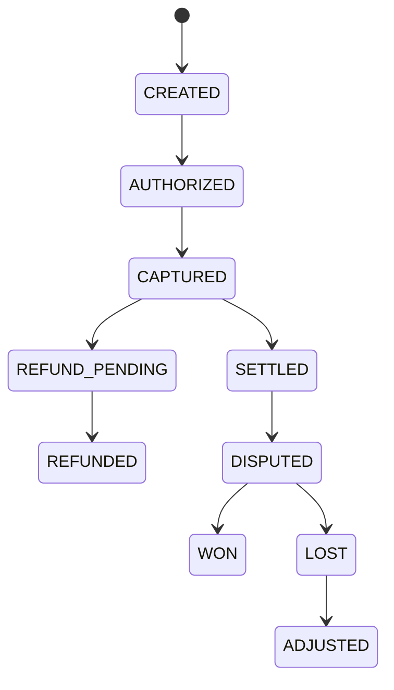

# Payment Lifecycle

Payments are modeled as durable state transitions.

## Typical lifecycle

```mermaid
stateDiagram-v2
    [*] --> CREATED
    CREATED --> AUTHORIZED
    AUTHORIZED --> CAPTURED
    CAPTURED --> SETTLED
    CAPTURED --> REFUND_PENDING
    REFUND_PENDING --> REFUNDED
    SETTLED --> DISPUTED
    DISPUTED --> WON
    DISPUTED --> LOST
    LOST --> ADJUSTED
```

Back to [README](../../README.md).
